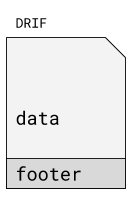

# drif_image
DRIF - raw image file format with a footer

# drif container format:


# supported image formats:
RGB888  
BGR888   
RGB888P  
BGR888P  
RGBA8888   
BGRA8888   
RGBA8888P  
BGRA8888P  
GRAY   
YUV420P  
YVU420P  
NV12   
NV21   

# drif footer structure
```
DRIF footer structure
typedef struct
{
    uint32_t magic;
    uint32_t version;
    uint32_t w;
    uint32_t h;
    uint32_t f;

} drif_footer_t;

```
